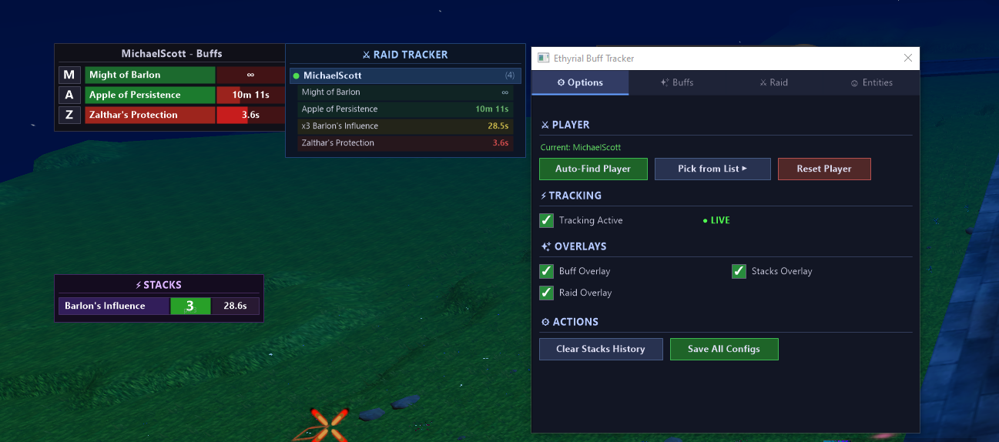

# Ethyrial Injector Pro

A modern, user-friendly DLL injector and buff tracker toolkit for **Ethyrial: Echoes of Yore**.

## Features

### Buff Tracker Overlay
- **Real-time buff/debuff monitoring** with color-coded timer bars
- Permanent buffs shown with ∞ symbol
- Stack count display on multi-stack effects
- Draggable overlay window positioned anywhere on screen
- Auto-resizes based on active buff count

### Stacks Tracker Overlay
- **Tracks multi-stack effects** separately with peak tracking
- Shows current stacks, peak stacks, and remaining duration
- Fade-out animation when stacks drop off
- Color indicators: green = at peak, yellow = active, red = dropped

### Raid Tracker Overlay
- **Monitor party/raid members' buffs in real-time**
- Green dot = nearby, Red dot = out of range
- Shows each tracked player's active effects with timers
- Add players by name or pick from nearby entity list

### Auto Loot
- **Automatically loots all items** from open corpse loot windows
- Hooks into `ContainerWindow.Update` on the Unity main thread for stability
- Calls `LootAll` via `runtime_invoke` — same path as clicking the button in-game
- Smart item detection: waits for container details to arrive from the server before looting
- Grace period ensures the loot window is fully initialized before triggering
- Re-checks item count after looting and retries if items remain
- Skips empty containers and non-loot windows (inventory, bank, etc.)
- Auto-disables after repeated failures to prevent crashes
- Toggle via **Settings > Misc** tab
- Zero work on background threads — runs entirely on the Unity main thread

### Quick Cast
- **Instantly casts spells** without requiring a target confirmation click
- Hooks into the spell casting system to skip the targeting step
- Toggle with `CTRL+Q`
- Can be enabled/disabled from **Settings > Misc** tab

### Settings GUI (F11)
- **Full dark-themed custom-painted settings window**
- 4 tabs: Options | Buffs | Raid | Entities

#### Options Tab
- Auto-Find Player or Pick from Entity List
- Toggle tracking on/off with live status indicator
- Show/hide individual overlays (Buff, Stacks, Raid)
- Reset player, clear stacks history, save all configs

#### Buffs Tab
- Checkbox list of all discovered buffs
- Filter modes: Show All, Whitelist (only checked), Blacklist (hide unchecked)
- All ON / All OFF buttons
- Save config to file

#### Raid Tab
- Tracked players list with add/remove
- Nearby players list with refresh and one-click add
- Type-to-add text input with Enter support
- Save raid config to file

#### Entities Tab
- **Visual entity picker** — no more console number typing
- Shows all living entities with name, effect count, and status
- Color coded: green = current player, cyan = has effects, gray = mobs
- Click to select, click "Select This Entity" to start tracking
- Sorted: current player first, then by effect count

### Console (Advanced)
- Debug console with color-coded logging
- All features also accessible via keyboard shortcuts
- Crash handler with error code reporting

### Keyboard Shortcuts
| Key | Action |
|-----|--------|
| `F1` | Find player (auto-detect, falls back to entity picker) |
| `F2` | Start/Stop tracking |
| `F3` | Toggle Buff overlay |
| `F4` | Toggle Stacks overlay |
| `F5` | Buff filter config (console) |
| `F6` | List entities (console) |
| `F7` | Reset player |
| `F8` | Clear stacks history |
| `F9` | Raid config (console) |
| `F11` | **Settings Window (GUI)** |
| `CTRL+Q` | **Toggle Quick Cast** |
| `END` | Save all configs + Unload |

### Persistent Configuration
- `ethyrial_buffs.cfg` — Buff filter settings and enabled/disabled states
- `ethyrial_raid.cfg` — Raid tracker player list
- Auto-loads on startup, manual save from GUI or on unload

### Technical Details
- IL2CPP runtime resolver for Unity game internals
- GDI+ rendered overlays with transparency and anti-aliasing
- Multi-threaded: separate overlay, data, and input threads
- Main-thread hooks for Auto Loot and Quick Cast (Unity-safe)
- Safe memory reading with `IsBadReadPtr` validation and SEH wrappers
- `runtime_invoke` for managed method calls — proper IL2CPP calling convention
- DLL injection via standard injector

## How to Use

1. Launch **Ethyrial: Echoes of Yore**
2. Run the injector and inject the DLL
3. Wait for the console to show "READY"
4. Press `F1` to find your player (or `F11` → Entity Picker)
5. Press `F11` to open Settings and configure overlays, buffs, raid tracking, Auto Loot, and Quick Cast
6. Press `CTRL+Q` to toggle Quick Cast on/off
7. All overlays are draggable — position them wherever you like

## Credits

- Created by **MrJambix**
---

**RYAN IS AWARE OF THIS PROJECT.**